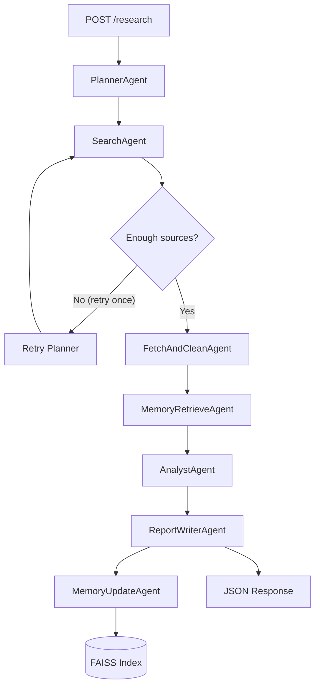

# Enterprise AI Due Diligence Agent

Live Demo: https://<your-deployed-app>/docs

Portfolio-grade multi-agent research assistant for company due diligence. The system plans targeted research, gathers evidence from web sources, synthesizes insights, and generates a structured report with citations. It also stores learned context in a persistent local FAISS memory index to improve future runs.

## Features
- Multi-agent orchestration with LangGraph (planner, search, fetch/clean, memory retrieve, analyst, writer, memory update).
- Dual LLM support:
  - Primary: OpenAI GPT models (if `OPENAI_API_KEY` exists).
  - Fallback: local Ollama (`llama3.1:8b`).
- FastAPI backend with schema-validated request/response.
- FAISS + sentence-transformers memory (`./data/faiss_index/`) persisted across runs.
- Citation-aware structured report output.
- Dockerized for local and cloud deployment.
- Optional Streamlit UI.

## Architecture


## Repository Structure
```text
enterprise-ai-due-diligence-agent/
  apps/
    api/
      main.py
      routes.py
      schemas.py
      deps.py
    ui/
      streamlit_app.py
  src/
    core/
      graph.py
      agents.py
      state.py
      config.py
      logging.py
    tools/
      search.py
      fetch.py
      utils.py
    rag/
      embeddings.py
      vectorstore.py
      chunking.py
    memory/
      memory_manager.py
      schemas.py
  data/
    faiss_index/
    cache/
  tests/
    test_api.py
    test_graph.py
  .env.example
  .gitignore
  requirements.txt
  Dockerfile
  docker-compose.yml
  README.md
  LICENSE
```

## API
### `GET /health`
Response:
```json
{"ok": true, "service": "enterprise-ai-due-diligence-agent"}
```

### `POST /research`
Request:
```json
{
  "company": "Stripe",
  "focus": ["pricing", "competitors"],
  "depth": "standard",
  "use_memory": true
}
```

Response schema:
```json
{
  "company": "Stripe",
  "generated_at": "2026-02-18T12:00:00+00:00",
  "executive_summary": "...",
  "sections": [
    {
      "title": "Company Overview",
      "content": "markdown",
      "citations": [
        {"url": "https://...", "title": "...", "snippet": "..."}
      ]
    }
  ],
  "memory_used": true,
  "memory_updates": {"added_docs": 10, "added_sources": 6}
}
```

## Local Setup
```bash
python -m venv venv
# Windows
venv\Scripts\activate
# macOS/Linux
# source venv/bin/activate

pip install -r requirements.txt
cp .env.example .env
```

Optional `.env` values:
- `OPENAI_API_KEY=...`
- `OPENAI_MODEL=gpt-4.1-mini`
- `OLLAMA_MODEL=llama3.1:8b`
- `OLLAMA_BASE_URL=http://localhost:11434`
- `ENABLE_WEB_SEARCH=true`

### Run API
```bash
uvicorn apps.api.main:app --reload --port 8000
```

### Run UI (optional)
```bash
streamlit run apps/ui/streamlit_app.py
```

### Run Tests
```bash
pytest -q
```

## Docker
```bash
docker compose up --build
```

Then open:
- API docs: `http://localhost:8000/docs`
- Health: `http://localhost:8000/health`

## cURL Examples
```bash
curl -X GET http://localhost:8000/health
```

```bash
curl -X POST http://localhost:8000/research \
  -H "Content-Type: application/json" \
  -d '{"company":"Stripe","focus":["pricing","competitors"],"depth":"standard","use_memory":true}'
```

## Deployment (Render)
1. Push this repo to GitHub.
2. In Render, create a new `Web Service` from the GitHub repo.
3. Runtime: `Python 3.11+`.
4. Build command:
   - `pip install -r requirements.txt`
5. Start command:
   - `uvicorn apps.api.main:app --host 0.0.0.0 --port $PORT`
6. Add environment variables:
   - `OPENAI_API_KEY` (optional)
   - `OPENAI_MODEL`
   - `OLLAMA_MODEL` (if using external Ollama endpoint)
   - `OLLAMA_BASE_URL`
   - `ENABLE_WEB_SEARCH=true`
7. Deploy and verify:
   - `https://<your-service>.onrender.com/health`
   - `https://<your-service>.onrender.com/docs`

## Screenshots (Placeholders)
- `docs/screenshots/api-docs.png` - FastAPI Swagger view.
- `docs/screenshots/research-response.png` - sample `/research` JSON.
- `docs/screenshots/ui-streamlit.png` - Streamlit dashboard.

## Reliability & Safety Notes
- URL deduping before fetch.
- HTTP timeouts and fetch failure handling.
- tiny-content skipping (`MIN_CLEAN_CHARS`).
- citation attachment per section.
- uncertainty marker (`[Not fully confirmed]`) when evidence is weak.
- one search retry max to prevent infinite loops.

## Add to Resume
- Built a production-grade multi-agent due diligence platform using LangGraph, FastAPI, and FAISS memory, reducing manual research effort with automated planning, evidence retrieval, and structured reporting.
- Implemented dual-LLM execution (OpenAI + Ollama fallback), citation-grounded analysis, and persistent retrieval memory to improve research continuity across sessions.
- Containerized and deployment-ready architecture with API-first design, automated tests, and cloud deployment workflow (Render) for public demo delivery.
